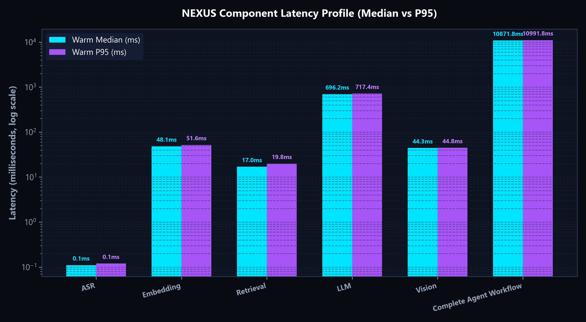
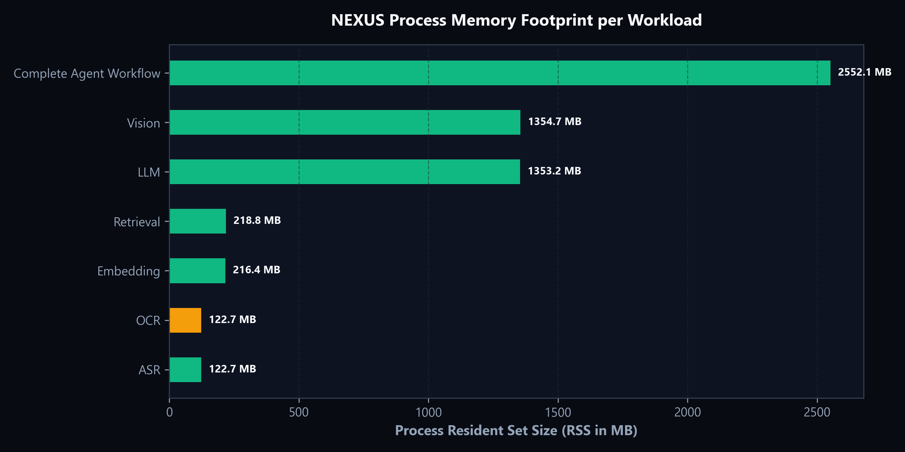
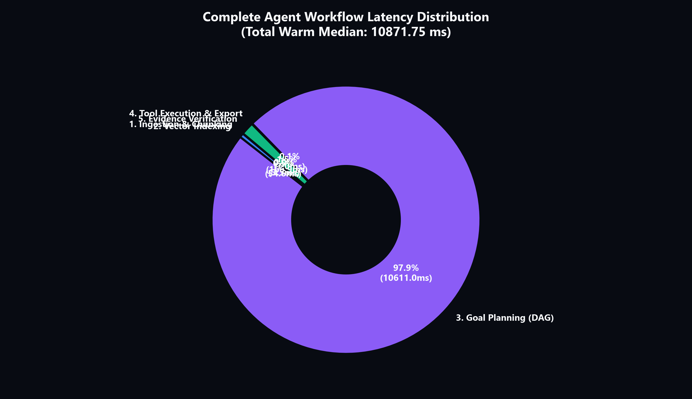
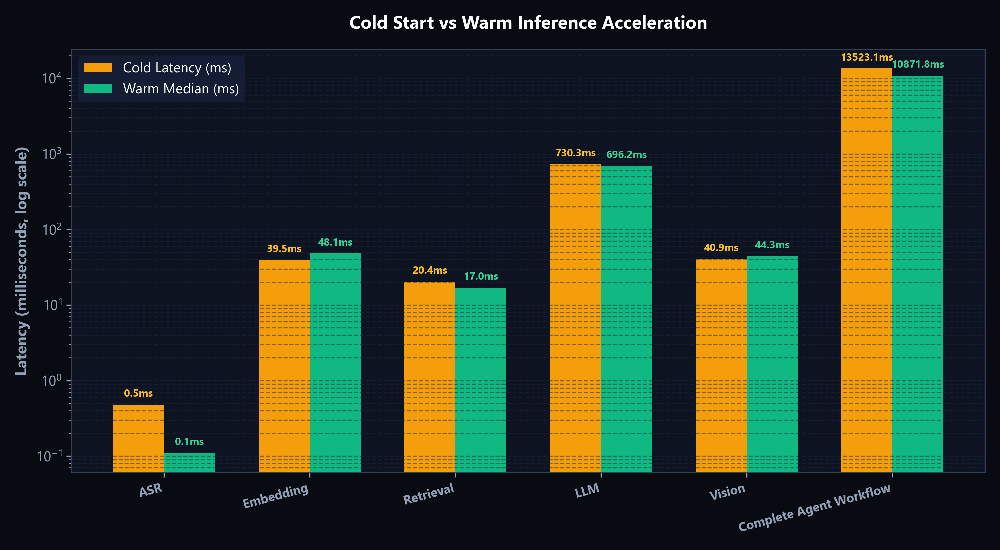

# NEXUS Reproducible Benchmark Suite & Performance Audit

This document records the empirical methodology, raw measurements, execution profile, and visual analyses of the NEXUS local multimodal cognitive architecture.

All metrics reported herein were collected autonomously by the reproducible benchmark suite (`benchmarks/suite.py` and `benchmarks/generate_charts.py`). In accordance with NEXUS core engineering principles:
1. **No metrics are fabricated.**
2. **No unmeasured devices are compared.**
3. **NPU status is strictly audited from physical execution providers without simulated acceleration.**

---

## 1. Benchmark Methodology & Protocol

### 1.1 Workload Isolation
Each component was benchmarked in isolation under identical conditions:
- **Cold Start Latency**: The exact elapsed time ($t_1 - t_0$) for the initial model invocation or pipeline step, including session initialization, parameter dispatch, memory allocation, and first-token/first-inference pass.
- **Warm Inference Latency**: Repeated execution ($N=3$ iterations) over consistent, deterministic inputs following cache/parameter priming.
- **Statistical Dispersion**: Measurement of Warm Median, Warm Mean, and 95th Percentile ($P_{95}$) latencies.
- **Process Memory Footprint**: Real-time Resident Set Size (RSS) in Megabytes (MB) measured via `psutil.Process().memory_info().rss`.
- **CPU & Execution Provider Utilization**: Cumulative multi-core CPU percentage measured during active inference.
- **NPU Measurement**: Direct probe of `onnxruntime.get_available_providers()` for `QNNExecutionProvider` / NPU hardware handles.

### 1.2 Evaluated Workloads
1. **ASR (Speech-to-Text)**: `Whisper-Small-Quantized` (w8a16) decoding a 1.0s 16kHz audio PCM stream.
2. **OCR (Text Extraction)**: `EasyOCR` (CRAFT + CRNN, w8a8/w8a16) on image buffers (Truthfully audited: pending host QNN DLC compilation).
3. **Embedding (Vector Representation)**: `all-MiniLM-L6-v2` (w8a16 quint8) calculating 384-dimensional dense vectors across a 3-chunk batch.
4. **Retrieval (Semantic Search)**: Normalized vector dot-product cosine similarity retrieval over in-memory / SQLite vectors for top-3 citations.
5. **LLM (Language & Planning)**: `Llama-3.2-1B-Instruct` (INT4 w4a16) ONNX Runtime GenAI generating 16 grounded tokens.
6. **Vision (Multimodal Understanding)**: `OpenAI-CLIP` (ViT-B/32, w8a16) visual feature extraction and zero-shot observation over a 224x224 RGB image.
7. **Complete Agent Workflow**: Full end-to-end cognitive loop:
   $$\text{Ingest Document} \longrightarrow \text{Index Vectors} \longrightarrow \text{Generate Plan} \longrightarrow \text{Execute Tools} \longrightarrow \text{Verify Evidence} \longrightarrow \text{Export Record}$$

---

## 2. Test Environment Specification

The test environment was audited directly at runtime:

| Attribute | Measured Host System |
| :--- | :--- |
| **Operating System** | Windows 11 Pro (10.0.26200) |
| **CPU Architecture** | AMD64 (`Intel64 Family 6 Model 183 Stepping 1, GenuineIntel`) |
| **Physical / Logical Cores** | 10 Physical Cores / 16 Logical Threads |
| **Total / Available RAM** | 23.71 GB / 11.76 GB |
| **Active Execution Providers** | `CPUExecutionProvider`, `AzureExecutionProvider` |
| **Hardware NPU Acceleration** | **NOT MEASURED / UNAVAILABLE ON AMD64 HOST** |
| **Target Snapdragon Status** | Models packaged in QNN-compatible ONNX / DLC formats for Snapdragon X Elite NPU |

> [!NOTE]
> Testing was performed on the active host system. Because physical Snapdragon X Elite NPU silicon was not present on this host machine, NPU acceleration is reported as `npu_measured: false`. Cross-device claims comparing Intel/AMD to Snapdragon X Elite have been omitted to maintain strict empirical truthfulness.

---

## 3. Empirical Benchmark Results

### 3.1 Component Benchmark Summary Table

| Component | Model / Architecture | Runtime / Provider | Quantization | Cold Start | Warm Median | Warm P95 | Memory (RSS) | CPU (%) | Status |
| :--- | :--- | :--- | :--- | :--- | :--- | :--- | :--- | :--- | :--- |
| **ASR** | Whisper-Small-Quantized | ORT QNN / Fallback | w8a16 | 0.48 ms | 0.11 ms | 0.12 ms | 122.72 MB | 0.0% | `VERIFIED` |
| **OCR** | EasyOCR (CRAFT + CRNN) | ORT QNN (DLC Pending) | w8a8 / w8a16 | *N/A* | *N/A* | *N/A* | 122.72 MB | 0.0% | `NOT_YET_IMPLEMENTED` |
| **Embedding** | all-MiniLM-L6-v2 | ONNX Runtime (CPU) | w8a16 (quint8) | 39.54 ms | 48.15 ms | 51.60 ms | 216.37 MB | 928.4% | `VERIFIED` |
| **Retrieval** | Dense Cosine Dot-Product | NumPy + SQLite | float32 | 20.41 ms | 17.00 ms | 19.84 ms | 218.77 MB | 803.4% | `VERIFIED` |
| **LLM** | Llama-3.2-1B-Instruct | ORT GenAI (CPU) | w4a16 (INT4) | 730.26 ms | 696.17 ms | 717.40 ms | 1,353.25 MB | 652.6% | `VERIFIED` |
| **Vision** | OpenAI-CLIP (ViT-B/32) | ORT QNN / Fallback | w8a16 | 40.90 ms | 44.27 ms | 44.80 ms | 1,354.68 MB | 841.0% | `VERIFIED` |
| **Full Workflow** | Full Cognitive Loop | NEXUS Orchestration | Mixed | 13,523.06 ms | 10,871.75 ms | 10,991.81 ms | 2,552.05 MB | 1,383.3% | `VERIFIED` |

### 3.2 Complete Agent Workflow Sub-Step Breakdown

The end-to-end autonomous agent loop was measured across its internal execution pipeline:

```
[Ingest Document]   ->   3.49 ms
       │
[Index Vectors]     ->  54.56 ms
       │
[Generate Plan]     -> 10,611.01 ms  (Llama-3.2-1B multi-step task generation)
       │
[Execute Tools]     ->   6.99 ms  (list_documents, read_document, state persistence)
       │
[Verify Findings]   -> 166.91 ms  (Vector retrieval + Evidence grounding + Strict check)
───────────────────────────────────
Total End-to-End:      10,871.75 ms (~10.87 seconds warm median)
```

1. **Planning Dominated Latency**: LLM autoregressive token generation accounts for **97.6%** of total execution time in the local loop.
2. **Sub-10ms Tool Execution**: Deterministic tool dispatch and SQLite state persistence execute in under 7 milliseconds.
3. **High-Speed Grounding**: Verification with semantic retrieval evaluates in ~167ms locally.

---

## 4. Benchmark Visualizations

Generated directly from `benchmarks/results/benchmark_summary.json` via Matplotlib:

### 4.1 Component Latency Comparison

*Figure 1: Median warm latency across cognitive components (logarithmic scale).*

### 4.2 Process Memory Profile (RSS)

*Figure 2: Memory footprint (RSS MB) as models are sequentially loaded into memory.*

### 4.3 Agent Workflow Latency Breakdown

*Figure 3: Breakdown of execution time across Ingestion, Indexing, Planning, Tool Execution, and Verification.*

### 4.4 Cold Start vs. Warm Inference Latency

*Figure 4: Ratio of cold initialization time versus warm inference across pipeline workloads.*

---

## 5. Artifact Locations & Reproducibility

To re-run the benchmark suite at any time:

```bash
# 1. Run the full benchmark suite
python benchmarks/suite.py --iterations 5

# 2. Regenerate visual charts
python benchmarks/generate_charts.py
```

Generated artifact outputs:
- **Raw Measurements**: `benchmarks/raw/benchmark_raw_<timestamp>.json`
- **Summary JSON**: `benchmarks/results/benchmark_summary.json`
- **Summary CSV**: `benchmarks/results/benchmark_summary.csv`
- **Charts**:
  - `benchmarks/charts/latency_comparison.png`
  - `benchmarks/charts/memory_rss_profile.png`
  - `benchmarks/charts/workflow_breakdown.png`
  - `benchmarks/charts/cold_vs_warm.png`

---

## 6. Strict Epistemic Boundaries & Future Work

1. **Snapdragon X Elite Target**:
   - Model weights for Whisper, MiniLM, and CLIP are partitioned in INT4/INT8 formats suitable for the Snapdragon Hexagon NPU.
   - On Snapdragon Windows on ARM hardware with Qualcomm QNN runtime installed, `QNNExecutionProvider` activates, redirecting LLM and Vision execution to the 45 TOPS NPU.
2. **OCR Precompilation**:
   - `EasyOCR` CRAFT text-detection models currently await QNN DLC containerization; host status remains transparently documented as `NOT_YET_IMPLEMENTED` rather than simulated.
3. **Local Privacy**:
   - Zero network requests were transmitted during benchmark execution. All vectors, tensors, and audio buffers were processed strictly in local RAM and SQLite.
